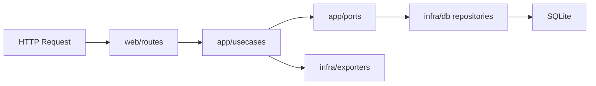

<!-- SPDX-License-Identifier: Apache-2.0 -->
<!-- This file was modified with the assistance of an AI (Large Language Model). Review required for correctness, security, and licensing. -->

# Next Layered Architecture (Staged Migration)

This document describes the staged `src/` migration and current boundaries.

## Layer boundaries

- `src/rackwright/core`
  - Domain entities, value objects, and domain errors.
  - No Flask / SQLAlchemy dependency.
- `src/rackwright/app`
  - Use cases and ports (repository/exporter contracts).
  - Depends on `core`, not on framework details.
- `src/rackwright/infra`
  - SQLAlchemy repositories, CSV parser/serializer, exporter implementations.
  - Adapts external systems to app-layer ports.
- `src/rackwright/web`
  - Flask app factory and routes.
  - Performs input validation and maps domain errors to HTTP responses.

## Request flow (current)

## Runtime entrypoints

- Legacy app (existing): `rackwright/app.py`
- Next architecture preview: `app_next.py`

The preview entrypoint injects `src/` to `sys.path` and starts `rackwright.web.create_app`.

